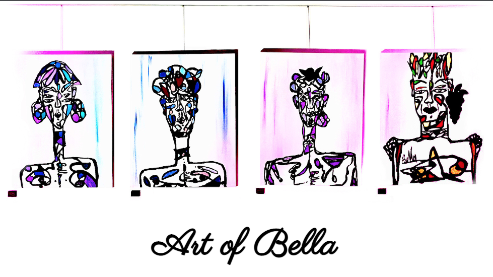
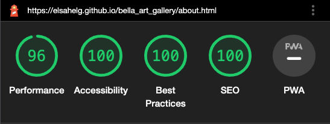
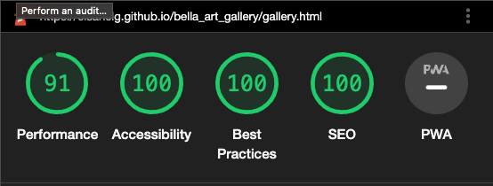

# <a href="https://github.com/elsahelg/bella_art_gallery/blob/main/README.md"> Bella Art Gallery </a>
Bella Art Gallery is a site to showcase Bella's (Ms.K) art and give an insight to her inspiration behind the making of the art. This site targets anyone who are intrested in Bella's different forms of art. This site is an opportunity to get a full view of Bella as a multi-artist and experience her different art expressions.  
 

## Features 
### Existing Features

<ul>
<li>Hero image
    <ul>
        <li>Is designed from paintings made by Bella, her unique style sets her signature to the site.</li> 
        <li>The image is positioned at the top of each page to give the user a first impression of Bella's art.</li>
    </ul>
        
         
<li>Navigation bar
<ul>
<li> Features the logo and additional three descriptive links, one to each page of the website: Home, About and Gallery. The links provides navigation between and from each page.</li>
<li> Is consistent in design and position throughout the site to enable easy access for the user.</li>
<li> Displays underline to each link when hovered over to indicate that it is a clickable link. </li>
</ul>
</li> 

<li><a href="https://github.com/elsahelg/bella_art_gallery/blob/main/index.html">The Home page </a>
<ul>
<li> The user is welcomed with two headings on each side of the page which is decorated by a background picture of Bella.</li> 
<li>The left side heading aims to awaken the user's interest to learn more about Bella as an artist. The heading is followed by a link that navigates the user to 'About'.</li>
<li>The right side heading aims to awaken the user's intrest to explore Bella's art. The heading is followed by a link that navigates the user to 'Gallery'.</li>
<li>The links are underlined when hovered over.</li></ul>
</li> 

<li> The Footer
<ul>
<li>Is static to the bottom of each page and provides the user with relavent social media links.</li>
<li>The links will open in a new tab to simplify the user's further exploring of the current site.</li></ul>
</li> 
 

<li> <a href="https://github.com/elsahelg/bella_art_gallery/blob/main/about.html">The About page </a>
<ul>
<li>Features information and artistic pictures of the Bella. Provides an overview of Bella's inspiration and different art forms.</li>
<li>Features artist contact information, 'mailto-link' which opens the users default mail program to simplify the user's opportunity to get in touch with Bella.</li>
<li>Further social media links are listed and sectioned with the relavent content of art form. Makes it easier for the user to target the right links in terms of intrest.</li></ul>
</li> 
 

<li><a href="https://github.com/elsahelg/bella_art_gallery/blob/main/gallery.html">The Gallery page</a>
<ul>
<li>Features a collage of Bella's paintings.</li>
<li>The user is provided to visually comprehend Bella's art.</li>
<li>The user is offered a text alternetive to each painting which informs the material of use and name of the painting.</li></ul>
</li> 
 
</ul>

## Features left to carry out

<ul>
    <li>Modify the Art Gallery content by enabling an option to upscale each painting.</li>
    <li>Add further Art content from Bella (videos of her art performance, more paintings to the Gallery).</li>
    <li>Add further content about Bella and/or Ms. K and her expressions of art.</li>
    <li>Fix bugs found in the Lighthouse testing, explained further down in this document.</li>
</ul>

## Testing layout and features responsive to different devices (screen width) with DevTools
 

 

### Screen width: 2300px and 1200px
 

### Home page: 
Responsive layout and features, no error was encountered

### About page: 
Responsive layout and features, no error was encountered

### Gallery page: 
Responsive layout and features, no error was encountered

### Hero image: 
Responsive layout and features, no error was encountered

### Footer: 
Responsive layout and features, no error was encountered

### Navigation bar and logo: 
Responsive layout and features, no error was encountered

 

### Screen width: 1100px, 770px, 450px and down
 

### Home page: responsive layout and features
<ul> 
    <li>Modify: content resized to correspond layout to screen size</li>
    <li>Features: links works adequate, content view adequate</li>
</ul>

### About page: responsive layout and features
<ul>
    <li>Modify: content resized to correspond layout to screen size</li>
    <li>Features: links works adequate, text and images view adequate</li>
</ul>

### Gallery page: responsive layout and features
<ul> 
    <li>Modify: column display less numerous to correspond layout to screen size</li>
    <li>Features: gallery images view adequate</li>
</ul>

### Hero image: responsive layout and features
<ul> 
    <li>Modify: resize height to correspond layout to screen size</li>
    <li>Features: image view adequate</li>
</ul>

### Footer: responsive layout and features
<ul>
    <li>Modify: resize font to correspond layout to screen size</li>
    <li>Features: links work adequate</li>
</ul>

### Navigation bar and logo: responsive layout and features
<ul>
    <li>Modify: resize font and lineheight to correspond layout to screen size</li>
    <li>Features: links work adequate, navigation bar and logo view adequate</li>
</ul>
 

 

## Lighthouse testing result:
 

Bugs related to high data consumption were found through the Lighthouse testing: 'Usage of image format JPEG or PNG' and 'Usage of full image sizes'. These bugs will be fixed by changing the current image formats and resizing the images before uploading them again. Due to a short time schedule these bugs remains unfixed for now but will be altered to minimize the consumption of data and maximize the user experience. 
 

## Validator testing

<ul>HTML <a href="https://validator.w3.org/nu/?showsource=yes&showoutline=yes&showimagereport=yes&doc=https%3A%2F%2Felsahelg.github.io%2Fbella_art_gallery%2Findex.html">official W3C validator</a>
<li>Passed through validation without error.</li></ul>
<ul>CSS offical <a href="https://jigsaw.w3.org/css-validator/validator">(Jigsaw) validator</a>
<li>Passed through validation without error.</li></ul>

## Credits
 

### Content
<ul>
    <li>All text about Bella and/or Ms. K is based on information and requests from Bella Demhat Aksoy Jämsen.</li>
    <li>The template for the repository was provided by <a href="https://codeinstitute.net/se/">Code Institute.</a></li>
    <li>Social media icons used in the footer and the About page is taken from <a href="https://fontawesome.com/">FontAwesome</a></li>
    <li>Fonts used are taken from <a href="https://fonts.google.com/">Google Fonts</a></li>
    <li>HTML and CSS tricks was learned and influenced from <a href="https://www.w3schools.com/default.asp">W3School</a></li>
</ul>

### Media 
<ul>
    <li>All photos and images used is credited and copyrighted to Bella Demhat Aksoy Jämsen.</li>
    <li>All external links are provided by Bella Demhat Aksoy Jämsen.</li>
</ul>